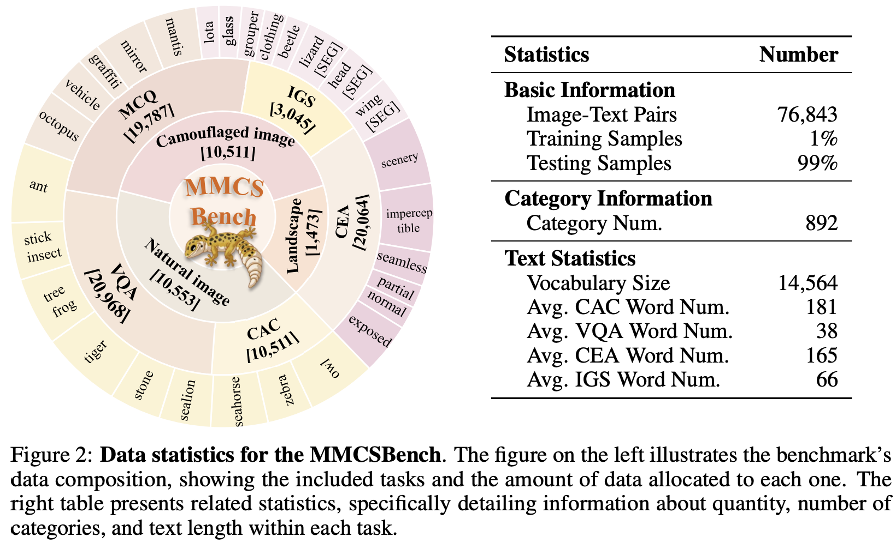
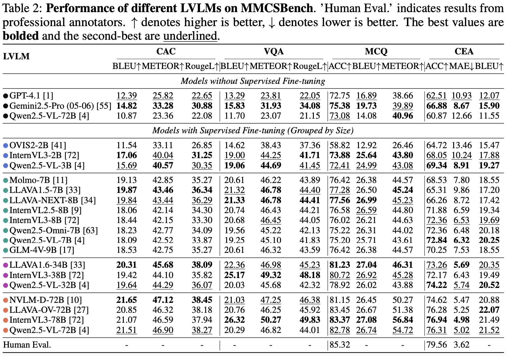

# MMCSBench: A Fine-Grained Benchmark for Large Vision-Language Models in Camouflage Scenes



**(Updating slowly, but keep going)** 

## Dataset Path

**Hugging Face**: https://huggingface.co/datasets/zjswsz/MMCSBench

**Kaggle**: https://www.kaggle.com/datasets/f2218284b51011e4e27d4c4d8b41eff771d0ec734c535a7a0b94bb2a02058a46?resource=download

## How to use

TODO

## Results




<!--### Key Features

- 🎯 **Fine-grained Evaluation**: Comprehensive assessment of LVLMs on camouflage scene understanding
- 🌿 **Diverse Scenarios**: Multiple camouflage types including natural, artificial, and adaptive camouflage
- 📊 **Multi-task Framework**: Object detection, classification, reasoning, and description tasks
- 🔄 **Standardized Protocol**: Consistent evaluation metrics and protocols for fair comparison
- 📈 **Comprehensive Analysis**: Detailed performance analysis across different model architectures

## 🚀 Getting Started

### Prerequisites

- Python 3.8 or higher
- PyTorch 1.9.0 or higher
- CUDA 11.0+ (for GPU acceleration)

### Installation

1. Clone the repository:
```bash
git clone https://github.com/zhangjinCV/NIPS2025-MMCSBench-A-Fine-Grained-Benchmark-for-Large-Vision-Language-Models-in-Camouflage-Scenes.git
cd NIPS2025-MMCSBench-A-Fine-Grained-Benchmark-for-Large-Vision-Language-Models-in-Camouflage-Scenes
```

2. Install dependencies:
```bash
pip install -r requirements.txt
```

3. Download the dataset:
```bash
python scripts/download_dataset.py
```

## 📂 Repository Structure

```
MMCSBench/
├── README.md                 # Project overview and instructions
├── LICENSE                   # License information
├── requirements.txt          # Python dependencies
├── setup.py                  # Package installation
├── data/                     # Dataset and data processing
│   ├── annotations/          # Ground truth annotations
│   ├── images/              # Benchmark images
│   └── scripts/             # Data processing scripts
├── models/                   # Model implementations
│   ├── base/                # Base model classes
│   ├── configs/             # Model configurations
│   └── pretrained/          # Pre-trained model weights
├── evaluation/               # Evaluation framework
│   ├── metrics/             # Evaluation metrics
│   ├── protocols/           # Evaluation protocols
│   └── results/             # Evaluation results
├── benchmarks/              # Benchmark tasks
│   ├── detection/           # Object detection tasks
│   ├── classification/      # Classification tasks
│   ├── reasoning/           # Reasoning tasks
│   └── description/         # Description generation tasks
├── tools/                   # Utility tools and scripts
├── docs/                    # Documentation
├── examples/                # Usage examples and demos
└── tests/                   # Unit tests
```

## 🔧 Usage

### Quick Start

Run the benchmark evaluation on a sample model:

```python
from mmcsbench import MMCSBenchmark
from mmcsbench.models import load_model

# Load benchmark
benchmark = MMCSBenchmark(config='configs/default.yaml')

# Load your model
model = load_model('your_model_name')

# Run evaluation
results = benchmark.evaluate(model)
print(results)
```

### Custom Evaluation

```python
# Evaluate on specific tasks
results = benchmark.evaluate(
    model=model,
    tasks=['detection', 'classification'],
    split='test'
)

# Generate detailed report
benchmark.generate_report(results, output_dir='results/')
```

## 📊 Benchmark Tasks

### 1. Object Detection
- **Task**: Localize camouflaged objects in natural scenes
- **Metrics**: mAP, Precision, Recall, F1-score
- **Difficulty Levels**: Easy, Medium, Hard

### 2. Classification
- **Task**: Classify types of camouflage and camouflaged objects
- **Metrics**: Accuracy, Top-k accuracy, Confusion matrices
- **Categories**: Animal, Military, Adaptive, Natural

### 3. Visual Reasoning
- **Task**: Answer questions about camouflage mechanisms and effectiveness
- **Metrics**: Accuracy, BLEU, ROUGE, CIDEr
- **Question Types**: Factual, Inferential, Counterfactual

### 4. Description Generation
- **Task**: Generate detailed descriptions of camouflage scenes
- **Metrics**: BLEU, METEOR, CIDEr, Human evaluation
- **Aspects**: Object properties, Camouflage mechanisms, Scene context

## 📈 Evaluation Results

### Supported Models

We provide evaluation results for the following LVLMs:

- GPT-4V
- LLaVA-1.5 (7B, 13B)
- InstructBLIP
- BLIP-2
- MiniGPT-4
- Flamingo
- And more...

### Performance Overview

| Model | Detection mAP | Classification Acc | Reasoning Acc | Description Score |
|-------|---------------|-------------------|---------------|-------------------|
| GPT-4V | 0.XXX | XX.X% | XX.X% | XX.X |
| LLaVA-1.5-13B | 0.XXX | XX.X% | XX.X% | XX.X |
| ... | ... | ... | ... | ... |

*Detailed results and analysis are available in the [evaluation results](evaluation/results/) directory.*

## 🤝 Contributing

We welcome contributions to MMCSBench! Please see our [Contributing Guidelines](CONTRIBUTING.md) for details on how to submit pull requests, report issues, and suggest improvements.

### Development Setup

1. Fork the repository
2. Create a development branch
3. Install development dependencies: `pip install -r requirements-dev.txt`
4. Make your changes
5. Run tests: `python -m pytest tests/`
6. Submit a pull request

## 📝 Citation

If you use MMCSBench in your research, please cite our paper:

```bibtex
@inproceedings{zhang2025mmcsbench,
  title={MMCSBench: A Fine-Grained Benchmark for Large Vision-Language Models in Camouflage Scenes},
  author={Zhang, Jin and [Other Authors]},
  booktitle={Advances in Neural Information Processing Systems},
  year={2025},
  publisher={Curran Associates, Inc.}
}
```

## 📄 License

This project is licensed under the MIT License - see the [LICENSE](LICENSE) file for details.

## 🙏 Acknowledgments

- Thanks to the computer vision and natural language processing communities
- Special thanks to contributors and collaborators
- Funding support: [Grant information if applicable]

## 📞 Contact

- **Author**: Jin Zhang
- **Email**: [contact email]
- **Homepage**: [personal/lab homepage]

For questions about the benchmark or issues with the code, please open an issue on GitHub or contact the authors directly.

----->

**Note**: This repository contains the official implementation of the MMCSBench benchmark presented at NeurIPS 2025. For the latest updates and announcements, please watch this repository and check our project page.
